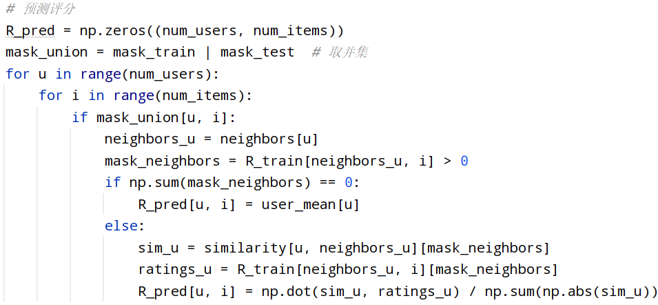

# 加强内容多样性的推荐系统算法开发

## 目录

# 摘要
# Abstract
# 1. 前言
## 1.1 研究背景与意义
### 1.1.1 推荐系统发展概况
### 1.1.2 内容多样性的重要性

## 1.2 本文研究内容及意义

## 1.3 本文的组织结构

# 2. 推荐系统基础理论与关键技术
## 2.1 推荐系统基本概念
### 2.1.1 推荐系统的分类与特点
### 2.1.2 推荐系统面临的挑战

## 2.2经典推荐算法
### 2.2.1协同过滤算法
### 2.2.2 基于内容的推荐
### 2.2.3 混合推荐方法

## 2.3 现代推荐技术
### 2.3.1 基于深度学习的推荐模型
### 2.3.2 双塔模型架构

## 2.4 小结

# 3.推荐多样性研究综述
## 3.1 多样性问题概述
### 3.1.1 多样性的定义与度量
### 3.1.2 多样性与准确性的权衡
### 3.1.3 多样性增强的意义

## 3.2 多样性增强方法
### 3.2.1 最大边际相关度（MMR）算法
### 3.2.2 行列式点过程（DPP）算法

## 3.3 方法比较与业界实践
### 3.3.1 各方法优缺点分析
### 3.3.2 业界应用案例

## 3.4 研究综述小结

# 4.系统设计与算法实现
## 4.1 系统设计概述
### 4.1.1 设计目标
### 4.1.2 系统架构与模块划分
## 4.2 数据集与预处理
### 4.2.1 MovieLens和Anime数据集介绍
### 4.2.2 数据清洗与特征构建
## 4.3 基础推荐模块实现
### 4.3.1 用户相似度计算方法
### 4.3.2 评分预测与推荐生成
## 4.4 多样性算法实现
### 4.4.1 MMR算法设计与实现
### 4.4.2 DPP算法设计与实现
## 4.5 关键技术难点与解决方案
# 5. 实验评估与结果分析
## 5.1 实验设计
### 5.1.1 评价指标设计
### 5.1.2 实验环境与参数配置
### 5.1.3对照实验方案
## 5.2 实验结果
### 5.2.1 准确性评估（RMSE、NDCG等）
### 5.2.2 多样性评估（ILS多样性、类别多样性）
## 5.3 结果分析与讨论
### 5.3.1 MMR与DPP算法比较
### 5.3.2 多样性与准确性权衡分析
### 5.3.3 实验启示与改进方向
# 6. 总结与展望
## 6.1 研究工作总结
## 6.2 存在的问题与不足
## 6.3未来工作展望
 

# 加强内容多样性的推荐系统算法开发
【摘要】随着信息技术的飞速发展，推荐系统已广泛应用于电商、视频、音乐等领域，成为解决信息过载问题的重要手段。然而，传统推荐算法在追求准确性的同时，常常忽视内容的多样性，导致推荐结果趋同、用户体验下降，甚至形成“信息茧房”效应。因此，提升推荐系统的内容多样性，已成为当前研究的热点与挑战之一。 
本论文围绕“如何在保证推荐准确性的基础上有效提升内容多样性”这一核心问题，综合运用了协同过滤（Collaborative Filtering）、最大边际相关度（MMR, Maximal Marginal Relevance）以及行列式点过程（DPP, Determinantal Point Process）等算法，构建了一个具有多样性增强能力的推荐系统。在系统实现方面，本文以MovieLens和anime数据集为基础，完成了包括数据预处理、基础推荐构建、多样性重排序等模块的设计与开发。在多样性增强阶段，分别实现了基于相关性和新颖性权衡的MMR算法以及基于子集选择概率优化的DPP方法，并通过实验验证其在提升推荐列表多样性方面的有效性。 
实验部分对推荐结果的准确性（如RMSE、NDCG）与多样性（如ILS指标、类别覆盖率）进行了系统评估。结果表明：与仅使用协同过滤算法的推荐系统相比，引入MMR与DPP后能在多样性指标上获得显著提升，同时保持较高的准确性。在此基础上，论文还探讨了多样性与准确性的平衡问题，并对两类算法的应用场景进行了比较分析。 
本文的研究不仅丰富了推荐系统多样性增强的技术路径，也为实际应用中构建更加智能化、人性化的推荐系统提供了理论与实践参考。 
【关键词】推荐系统；内容多样性；协同过滤；最大边际相关度（MMR）；行列式点过程（DPP）

# Developing recommendation system algorithms to enhance content diversity
【Abstract】With the rapid advancement of information technology, recommender systems have been widely applied in fields such as e-commerce, video streaming, and digital content platforms, serving as an essential solution to the problem of information overload. However, traditional recommendation algorithms tend to overemphasize accuracy while overlooking content diversity, often resulting in homogenized recommendation lists, diminished user satisfaction, and even the emergence of "information cocoons." Therefore, enhancing content diversity has become a critical challenge in the development of modern recommender systems. 
This thesis focuses on the core problem of how to improve recommendation diversity without significantly compromising accuracy. It integrates Collaborative Filtering (CF), Maximal Marginal Relevance (MMR), and Determinantal Point Process (DPP) algorithms to construct a diversity-aware recommendation framework. Using the MovieLens and anime datasets, the system was developed with modules covering data preprocessing, baseline recommendation generation, and diversity-enhancing re-ranking strategies. Specifically, MMR is implemented to balance item relevance and novelty, while DPP is employed to optimize the probability distribution over item subsets to encourage diversity. 
Comprehensive experiments were conducted to evaluate both accuracy metrics (e.g., RMSE, NDCG) and diversity metrics (e.g., Intra-List Similarity, category coverage). The results show that, compared with standard collaborative filtering, the proposed system significantly improves diversity performance while maintaining satisfactory accuracy. Furthermore, this thesis analyzes the trade-off between accuracy and diversity and compares the applicability of MMR and DPP in different recommendation scenarios. 
This study enriches the technical approaches to diversity in recommender systems and provides theoretical insights and practical guidance for building more intelligent and user-centric recommendation applications.  
【Key words】Recommender Systems; Content Diversity; Collaborative Filtering; Maximal Marginal Relevance (MMR); Determinantal Point Process (DPP)

# 1. 前言
## 1.1 研究背景与意义
### 1.1.1 推荐系统发展概况
随着信息技术的飞速发展，用户面对的信息过载问题愈发严重。推荐系统作为个性化信息过滤的重要技术，已经广泛应用于电子商务、社交平台、视频点播、新闻资讯等领域。其核心思想是根据用户的历史行为和兴趣偏好，从海量内容中筛选出最有可能感兴趣的项目，为用户提供高效、精准的服务。 
推荐系统从最初基于规则和专家知识驱动，发展至以协同过滤（Collaborative Filtering）为代表的数据驱动方法。近年来，随着深度学习、图神经网络（GNN）、强化学习等技术的引入，推荐系统逐步向高维建模、实时反馈、自适应优化等方向演进，推荐准确性显著提升。 
然而，推荐系统过度追求准确率的同时，也带来了内容同质化、兴趣局限性增强等问题，导致用户长期暴露于有限类型的信息中，形成“信息茧房”（Filter Bubble）与“回音室效应”（Echo Chamber），削弱了推荐系统的探索性与用户体验。
### 1.1.2 内容多样性的重要性
在信息检索与推荐系统领域，结果多样性不仅是一个技术指标，更是影响系统整体效能和用户体验的关键因素。高多样性的推荐结果能够产生多方面的积极影响： 
首先，多样性能够有效避免信息冗余，显著提升推荐列表的覆盖广度。当系统仅关注结果的相关性时，往往会产生内容高度相似的推荐项，这种冗余会直接降低推荐列表的信息量。通过引入多样性机制，系统可以在保证核心相关性的同时，覆盖更广泛的内容维度，从而为用户提供更具信息价值的结果集合。 
其次，多样性机制能够增强系统的探索能力，促进用户兴趣的拓展。在推荐系统场景下，过度专注于用户已知兴趣的" exploitation"策略可能导致推荐内容逐渐趋同，形成信息茧房。而适当的多样性引入可以平衡"exploration"与"exploitation"，帮助用户发现潜在感兴趣的新内容领域，实现兴趣边界的自然扩展。 
第三，多样性策略能够显著增加长尾内容的曝光机会，这对平台内容生态建设具有重要意义。在传统的推荐机制下，热门内容往往获得不成比例的曝光量，而大量优质长尾内容难以获得展示机会。通过设计合理的多样性算法，可以为小众内容创造公平的展示机会，促进平台内容生态的健康发展。 
最后，从长期效果来看，多样性推荐能够提高用户留存率并增强对平台的信任感。单调重复的推荐内容容易导致用户疲劳，而富有变化且具有发现性的推荐体验则能持续吸引用户。同时，当用户感知到平台推荐的内容丰富且不偏颇时，会建立更强的使用粘性和信任感。这种长期效应对于商业推荐系统尤为重要。 
Carbonell 和 Goldstein [1] 首次将**最大边际相关度（MMR）**用于文档重排序，提出在相关性与多样性之间权衡的思想，对后续推荐系统的多样性研究产生了深远影响。而近年来如 Borodin 等 [2] 提出的最大和多样化问题、Chen 等 [3] 对 DPP 的高效推断优化，使得推荐系统在多样性目标建模与求解效率上取得重要突破。 
因此，如何在保障推荐相关性的同时提升内容的多样性，已成为现代推荐系统不可或缺的研究方向。

## 1.2 本文研究内容及意义
本文围绕“提升推荐系统内容多样性”的核心目标，结合协同过滤算法与典型多样性增强技术（MMR与DPP），构建了一个具备准确性与多样性双优化能力的推荐系统。主要研究工作如下：
1. 系统设计与实现：在协同过滤基础上，集成MMR与DPP作为后排序机制，实现推荐结果的多样性控制；
2. 算法对比与参数调优：基于两个不同结构的数据集（MovieLens与Anime），分析MMR与DPP在不同θ值下的性能变化；
3. 评估体系构建：通过NDCG、ILS、类别覆盖率等指标，可视化分析准确性与多样性的权衡效果；
4. 实验与验证：在真实数据集上对所提方法进行系统实验，验证其在实际应用中的可行性与实用性。

本文的研究不仅有助于深化对多样性推荐机制的理解，也为推荐系统在“个性化+探索性”双重目标下的优化设计提供了实践参考： 
1. 提升推荐系统的用户体验与探索性。多样性控制机制能够有效缓解推荐列表中“重复率高”“兴趣过拟合”等问题，帮助用户突破兴趣边界、拓展内容认知，从而增强平台的使用粘性与用户长期满意度。
2. 构建多目标优化推荐系统的实现路径。本文针对准确性与多样性两大推荐目标的冲突问题，提出并实现了结合 MMR 与 DPP 的双重优化机制，提供了可落地、可复用的推荐系统多目标优化实现方案，兼顾了推荐的个性化精准性与列表结构的差异性。
3. 完善推荐系统多样性评估体系。针对传统推荐系统以准确率为唯一优化目标的局限，本文引入ILS（Intra-List Similarity）、类别覆盖率等指标，对推荐结果的结构特性进行系统评估，构建了覆盖准确性与多样性双维度的评价体系。

## 1.3 本文的组织结构
本文共分六章，各章节内容如下： 
- 第1章：介绍推荐系统的发展背景、内容多样性的重要性、本文研究内容与意义、本文组织结构，为后续章节奠定理论基础和研究动机。
- 第2章：系统梳理推荐系统的基本概念、分类、面临的挑战，回顾协同过滤、基于内容的推荐、混合推荐等经典算法，并介绍现代深度学习推荐模型及双塔架构，为算法实现提供理论支撑。
- 第3章：阐述多样性问题的定义、度量方法及其与准确性的权衡，详细介绍最大边际相关度（MMR）和行列式点过程（DPP）等多样性增强方法，分析各方法优缺点及业界应用案例，归纳当前研究进展。
- 第4章：描述推荐系统的整体设计目标、系统架构与模块划分，详细介绍数据集与预处理流程，基础协同过滤推荐模块的实现，以及MMR和DPP多样性算法的设计与实现。最后总结关键技术难点及解决方案。
- 第5章：介绍实验设计、评价指标、实验环境与参数配置，给出对照实验方案。系统展示准确性与多样性评估结果，深入分析MMR与DPP算法的表现及多样性与准确性的权衡关系，并提出实验启示与改进方向。
- 第6章：总结全文的主要研究工作，分析存在的问题与不足，展望未来在个性化多样性调节、多源信息融合、多目标优化、高效系统设计及真实场景验证等方向的研究前景。

# 2. 推荐系统基础理论与关键技术
## 2.1 推荐系统基本概念
### 2.1.1 推荐系统的分类与特点
### 2.1.2 推荐系统面临的挑战

## 2.2经典推荐算法
### 2.2.1协同过滤算法
### 2.2.2 基于内容的推荐
### 2.2.3 混合推荐方法

## 2.3 现代推荐技术
### 2.3.1 基于深度学习的推荐模型
### 2.3.2 双塔模型架构

## 2.4 小结

# 3.推荐多样性研究综述
## 3.1 多样性问题概述
### 3.1.1 多样性的定义与度量
### 3.1.2 多样性与准确性的权衡
### 3.1.3 多样性增强的意义

## 3.2 多样性增强方法
### 3.2.1 最大边际相关度（MMR）算法
### 3.2.2 行列式点过程（DPP）算法

## 3.3 方法比较与业界实践
### 3.3.1 各方法优缺点分析
### 3.3.2 业界应用案例

## 3.4 研究综述小结

# 4.系统设计与算法实现
## 4.1 系统设计概述
### 4.1.1 设计目标
本系统旨在构建一个集准确性与多样性于一体的推荐系统框架，通过基于用户的协同过滤算法生成初始推荐列表，并引入多样性重排序机制提升推荐内容的覆盖广度与新颖性，具体目标包括： 
1.实现用户-项目评分的基础协同过滤推荐； 
2.引入多样性重排序机制（MMR 与 DPP）； 
3.支持多样性与准确性指标的实验评估； 
4.提供简洁、模块化的实现结构便于扩展与调试。

### 4.1.2 系统架构与模块划分
系统整体架构如图 4.1 所示，主要分为以下几个模块： 
1.数据加载与预处理模块：负责读取、清洗并格式化原始数据。 
2.协同过滤推荐模块：基于用户或物品相似度生成初始推荐列表。 
3.多样性增强模块：使用 MMR 和 DPP 对推荐列表进行重排序。 
4.评估模块：提供准确性与多样性相关指标计算与可视化支持。  

图4.1 系统整体架构

## 4.2 数据集与预处理
### 4.2.1 MovieLens和Anime数据集介绍
MovieLens是由明尼苏达大学GroupLens研究组发布的经典开源数据集，广泛应用于推荐系统算法的开发与验证。其核心价值在于丰富的用户-电影交互数据与细粒度的电影内容元数据，为研究内容多样性推荐提供了多维分析基础。 
该小型数据集包含9742部电影中的100836个评级和3683个标签应用程序。这些数据是由610名用户在1996年3月29日至2018年9月24日期间创建的。该数据集生成于2018年9月26日，评分范围为0.5-5，以0.5分为增量。 
Anime数据集来自 myanimelist.net，专注于动漫推荐系统研究，涵盖用户评分与动漫内容元数据，适用于内容多样性分析与推荐算法开发。该数据集包含来自12,294部动漫的73,516名用户的用户偏好数据信息，评分1-10，若用户观看了未评分，则评分为-1。

### 4.2.2 数据清洗与特征构建
1.数据预处理 
过滤无效记录：移除用户未评分数据（如动漫数据中评分为-1的记录），保留有效评分数据以提升数据质量。 
用户与物品采样：针对动漫大规模数据，选取评分行为最活跃的前1000名用户和前1000部电影/动漫，降低计算复杂度，同时保证数据密度。 
ID重映射：将原始用户ID和物品ID重新映射为连续整数（从0开始），减少稀疏矩阵存储空间，避免索引碎片化。 
2.特征工程 
 类型特征编码：使用MultiLabelBinarizer对电影/动漫的流派（如“动作|科幻”）进行One-Hot编码，生成二进制特征向量。 
相似度矩阵：基于类型特征计算物品间相似度矩阵。

## 4.3 基础推荐模块实现
### 4.3.1 用户相似度计算方法
基于协同过滤中的用户相似度（User-Based CF），使用余弦相似度计算用户之间的兴趣相似性： 
$$\cos (i, j) = \frac{i \cdot j}{\| i \| \times \| j \|}$$，其中i与j表示用户的评分向量。

### 4.3.2 评分预测与推荐生成
预测公式采用加权平均评分方式，根据相似用户的历史评分和相似度权重进行评分预测。对目标用户未评分的物品进行排序并推荐前k个物品。
  

图4.2 评分预测程序实例

## 4.4 多样性算法实现
### 4.4.1 MMR算法设计与实现
MMR算法通过平衡相关性（预测评分）和多样性（物品间相似性）优化推荐列表： $MR _i = \theta \cdot reward _i - (1 - \theta) \cdot \max _{j \in S} sim(i,j)$。每轮选择MRi最高的物品，将其从集合R移入集合S。其中选中物品集合记作S，未选中物品集合记作R，reward为物品i与用户的相关度，sim(i,j)为物品i与集合S中已选物品j的相似度，θ控制相关性和多样性的权衡。

### 4.4.2 DPP算法设计与实现
DPP算法使用核矩阵建模项目之间的相似性，通过最大化子集行列式选择代表性强、冗余度低的推荐项。 
精排给n个物品打分，它们的向量表征为 $v_{1}, \cdots, v_{n} \in \mathbb{R}^{d}$。希望选出k个物品，使得其超平形体 $\mathcal{P}(v_1, \cdots, v_k)$ 的体积较大。计算n × n的相似度矩阵A，它是一个n × n的对称半正定矩阵。设集合S是[n]的子集，大小为k。定义 $A_S$ 是A的一个子矩阵，大小为k × k。 
Hulu 2018 年的论文将k-DPP应用于推荐系统重排，具体为求解这个优化问题： 
$\underset{\delta:|\delta|=k}{\arg\max}\theta\cdot\left(\sum_{i\in\mathcal{S}}reward_i\right)+(1-\theta)\cdot\mathrm{logdet}(\mathbf{A}_{\mathcal{S}})$（式4.3）

这是个组合优化问题，从n个物品中选出k个，目前没有高效的方法精确求解这个组合优化问题。Hulu 的论文使用一种贪心算法求解(式4.3)。用S表示已选中的物品，用R表示未选中的物品。算法的每一步求解这样一个问题： 
$$\arg\max_{i \in R} \lbrace \theta\cdot reward_i + (1 - \theta) \cdot \mathrm{logdet}(\mathbf{A}_{\mathcal{S\cup{\lbrace i \rbrace}}}) \rbrace.（式4.4）$$

因为 $A_S$ 是对称半正定矩阵，因此存在Cholesky分解 $A_{\mathcal{S}}=LL^{\top}$，L均为 $|S|\times|S|$ 的下三角矩阵。矩阵 $\mathbf{A}_ {S \cup {\lbrace i\rbrace }}$ 记作：  

$$\mathbf{A}_ {S\cup\{i\}}=
\begin{bmatrix}
A_ \mathcal{S} & a_i \\
\boldsymbol{a}_ i ^ \top & a_{ii} \\
\end{bmatrix}.(式4.5)$$

上式中 $a_i$ 的元素是 $v_i^{\top}v_j$， $\forall j\in\mathcal{S}$。而 $a_ {ii}=\boldsymbol{v}_ {i} ^{\top} \boldsymbol{v}_ {i} = 1$。矩阵 $\mathbf{A}_ {S \cup {\lbrace i\rbrace }}$ 的Cholesky分解可写作：

$$\mathbf{A}_ {S \cup {\lbrace i\rbrace}}=
\begin{bmatrix}
L & 0 \\
c_ i ^ \top & d_i \\
\end{bmatrix}
\begin{bmatrix}
L & 0 \\
c_ i^ \top & d_i \\
\end{bmatrix} ^ \top.（式4.6）$$

其中 $c_i$ 和 $d_i$ 未知。由(式4.5)和(式4.6)可得：

$$\mathbf{A}_ {S \cup {\lbrace i\rbrace}}=
\begin{bmatrix}
A_S & a_i \\
\boldsymbol{a}_i^\top & 1
\end{bmatrix}=
\begin{bmatrix}
\boldsymbol{LL}^\top & \boldsymbol{Lc}_i \\
\boldsymbol{c}_i^\top\boldsymbol{L}^\top & \boldsymbol{c}_i^\top\boldsymbol{c}_i+d_i^2
\end{bmatrix}.（式4.7）$$

可得两个公式： $a_i =Lc_i$ 和 $1=c_{i}^{T}c_{i}+d_{i}^{2}$ 
L和 $a_i$ 都是已知的，只需求出未知的 $c_i$ 和 $d_i$。由 $c_{i}=L^{-1}a_{i}$ 可算出 $d_i^2=1-c_i^\top c_i$，由下三角矩阵和行列式定义可知：

$$det\left(
\begin{bmatrix}
L & 0 \\
c_i^\top & d_i
\end{bmatrix}\right)=det(L)\times d_i.$$

由于 $\det(\mathrm{XY})=\det(\mathrm{X})\det(\mathrm{Y})$，可得到

$$det(\mathbf{A}_ {S \cup {\lbrace i\rbrace }})=det\left(
\begin{bmatrix}
\boldsymbol{L} & \boldsymbol{0} \\
\boldsymbol{c}_i^T & d_i
\end{bmatrix}
\begin{bmatrix}
\boldsymbol{L} & \boldsymbol{0} \\
\boldsymbol{c}_i^\top & d_i
\end{bmatrix}^\top\right)=det(\boldsymbol{L})^2\times d_i^2.$$

贪心算法的公式(式4.4)可等价为

$$\arg\max_{i \in R} \theta\cdot reward_i + (1 - \theta) \cdot \mathrm{log}d_ i ^2.（式4.8）$$

那么求解k-DPP的贪心算法： 
1. 输入：n个物品的向量表征 $v_{1}, \cdots, v_{n} \in \mathbb{R}^{d}$ 和分数 $reward_1$,… , $reward_n$。 
2. 计算的相似度矩阵A，它的第(i,j)个元素等于 $a_{ij}=v_{i}^{T}v_{j}$。 
3. 选中reward分数最高的物品，记作i。初始化集合 $S= \lbrace i \rbrace$ 和1 × 1的矩阵L=[1]。（由于 $a_{ii}=v_ i ^\top v_i=1$），此时 $\mathbf{A}_ {S} = [a_{ii} = L L^\top]$）
4. 做循环，从t=1到k-1： 
    (a).对于每一个i∈R： 
        Ⅰ.行向量 $[\mathrm{a_{i}^\top},1]$ 是矩阵 $\mathbf{A}_ {S \cup \lbrace i \rbrace}$ 的最后一行。 
        Ⅱ.求解线性方程组 $a_i=Lc_i$，得到 $c_i$。 
        Ⅲ.计算 $d_i^2=1-c_i^\top c_i$ 
    (b).求解(式4.8)： $\mathrm{i ^\star = \arg \max_{i \in \mathcal{R}} \theta \cdot reward_i + (1-\theta) \cdot \log d_i ^2}$。 
    (c).更新集合 $\mathcal{S}\leftarrow\mathcal{S}\cup\lbrace\mathrm{i}^{\star}\rbrace$。 
    (d).更新下三角矩阵：

$$\mathrm{L} \leftarrow 
 \begin{bmatrix} 
 \mathrm{L} & 0 \\
 \mathrm{c}_ {\mathrm{i} ^ \star} ^ \mathrm{T} & \mathrm{d}_ {\mathrm{i} ^ \star} 
 \end{bmatrix}
 $$
 
6. 返回集合S，其中包含k个物品。

## 4.5 关键技术难点与解决方案
1.数据稀疏性问题 
 难点：用户-物品评分矩阵高度稀疏，导致相似度计算偏差。 
 解决方案：对电影、动漫ID、用户ID重映射，减少无评分且占用矩阵空间的物品，将稀疏矩阵转换为稠密矩阵。 
2.大规模数据处理 
 难点：动漫数据集规模较大，直接处理会导致内存溢出。 
解决方案：将用户相似度计算分批进行，减少内存占用。 
3.求解DPP问题困难 
 难点：行列式计算需要矩阵分解，计算复杂度高。 
 解决方案：使用Hulu论文中的贪心算法，运用Cholesky分解，可快速算出行列式。

 
# 5. 实验评估与结果分析
## 5.1 实验设计
### 5.1.1 评价指标设计
在本研究中，我们采用了全面的评价指标体系，同时考虑推荐系统的准确性和多样性： 
准确性指标： 
1.RMSE (Root Mean Square Error)：衡量预测评分与真实评分之间的偏差，数值越小表示推荐准确性越高。 
2.MAE (Mean Absolute Error)：评估预测评分与实际评分之间的平均绝对误差。 
3.平均评分：推荐列表中物品的平均预测评分，反映推荐物品的整体质量。 
4.NDCG（Normalized Discounted Cumulative Gain）：考虑推荐列表位置的准确性指标，值越高说明高评分物品排名越靠前。 
 多样性指标： 
1.内部相似性 (ILS, Intra-List Similarity) ：推荐列表中物品之间的平均相似度，值越低表示多样性越高。 
2.多样性：采用ILS（Intra-List Similarity）补集，值越高表示多样性越好。 
3.类别覆盖率（Category Coverage）：统计推荐列表中覆盖的类别数量比例，反映推荐内容的多样性广度。

### 5.1.2 实验环境与参数配置
编程语言：Python 3.11.5 
核心库：Pandas、NumPy、Scikit-learn、SciPy、Matplotlib 
实验平台：Windows 10，Intel i5-11300H，16GB内存 
推荐Top-N数量：N = 10 
Theta参数范围：0.0 到 1.0，步长为 0.1 
数据集： 
MovieLens：包含约10万条用户评分记录，电影类别明确。 
Anime：采样后包含约41万条用户对动画的评分记录，含多个标签与风格。

### 5.1.3对照实验方案
为全面评估多样性算法的效果，我们设计了以下对照实验： 
1. 基准方法 ：基于用户的协同过滤（UserCF），直接选择预测评分最高的物品作为推荐结果。
2. MMR算法 ：在协同过滤结果基础上，使用最大边际相关性算法进行重排序，平衡相关性和多样性。
3. DPP算法 ：在协同过滤结果基础上，使用行列式点过程算法进行多样性推荐。

对于MMR和DPP算法，我们测试了不同θ值（从0到1，步长为0.1）的效果，以分析参数对推荐结果的影响。 
实验流程：

1. 使用协同过滤生成用户对物品的预测评分
2. 评估原始协同过滤推荐的准确性和多样性
3. 对不同θ值的MMR和DPP算法进行测试
4. 比较不同算法在各项指标上的表现

## 5.2 实验结果
### 5.2.1 准确性评估（RMSE、NDCG等）
协同过滤基准性能： 

图5.1 MovieLens数据集协同过滤准确度预测结果

图5.2 Anime数据集协同过滤准确度预测结果

多样性算法的准确性表现： 
从图5.3和图5.4可以观察到，随着θ值的增加（更注重相关性），MMR和DPP算法的平均评分和NDCG值都呈现上升趋势，推荐准确度整体提升，MMR在中高θ准确性下均优于DPP。 

图5.3 MovieLens数据集MMR和DPP算法准确性结果

图5.4 Anime数据集MMR和DPP算法准确性结果

### 5.2.2 多样性评估（ILS多样性、类别多样性）
多样性指标整体呈下降趋势，表明随着Theta增大，推荐列表内部差异性增强，MMR与DPP均有效提升了列表多样性。 
类别覆盖率在Anime数据集上尤为明显，DPP显著优于MMR，推荐内容更加分散；在MovieLens上两者接近，但DPP略优。 

图5.5 MovieLens数据集MMR和DPP算法多样性结果

图5.6 Anime数据集MMR和DPP算法多样性结果/p>

## 5.3 结果分析与讨论
### 5.3.1 MMR与DPP算法比较
1.准确性表现 
MMR算法在准确性指标（平均评分与NDCG）上表现更为稳定，其优化目标直接关联用户偏好，因此在个性化推荐场景中能 consistently 提升推荐结果的精准度。 
DPP算法在部分参数设定下，准确性略低于MMR，表明其权衡多样性的设计可能对准确性产生轻微抑制。 
2.多样性表现 
 MMR算法的局限性体现在类别多样性（Category Diversity）较低，因其倾向于选择相似性高的项目以满足核心用户需求。 
DPP算法通过行列式点过程（Determinantal Point Process）的数学特性，显著提升了推荐结果的多样性（Diversity）和覆盖率（Coverage），尤其适合需要探索用户潜在兴趣的场景。 
3.计算复杂度 
 MMR算法计算复杂度较低，实现简单，适合大规模数据下的实时推荐；DPP算法计算复杂度较高，对计算资源要求较高，可能限制其在超大规模系统中的应用。 
4.适用场景总结 
 MMR算法更适用于准确性优先的个性化推荐系统（如电商精准推荐），其稳定性与高效性能够满足核心业务需求。 
DPP算法适合多样性优先的探索式推荐（如新闻流或内容发现平台），通过牺牲部分准确性换取长尾内容的曝光，增强用户体验的新颖性。

### 5.3.2 多样性与准确性权衡分析
从相关性-多样性权衡图可以看出，两种算法都呈现出明显的帕累托前沿曲线，表明准确性和多样性之间存在权衡关系，在θ≈0.5附近能达到满意的推荐质量和多样性。 
DPP在牺牲较少准确性的同时获得更高多样性，适合对内容覆盖范围有要求的推荐应用。MMR适合在尽量保证准确性的前提下略微提升多样性。 

图5.7 MovieLens数据集MMR和DPP算法相关性-多样性权衡关系

图5.8 Anime数据集MMR和DPP算法相关性-多样性权衡关系

### 5.3.3 实验启示与改进方向
多样性算法在不同数据集表现略有差异，应结合数据特性灵活选择。 
θ参数的调节对于实现“个性化 vs 多样性”的平衡尤为关键，可考虑引入用户偏好驱动的动态调参机制。 
后续研究可尝试将MMR与DPP进行融合或改进，引入时间、上下文或情绪等因素，提升推荐的情境相关性和用户满意度。

# 6. 总结与展望
## 6.1 研究工作总结
本研究围绕如何在推荐系统中提升推荐内容的多样性展开，设计并实现了一个结合协同过滤与多样性增强算法的推荐系统。主要研究工作与成果如下： 
系统设计与实现：构建了一个完整的推荐系统框架，支持用户协同过滤推荐，并集成了两种多样性优化算法——MMR和DPP。 
多样性增强方法研究： MMR算法通过在推荐排序中平衡相关性与多样性，有效提升了推荐内容间的差异性；DPP算法基于概率建模选择信息互补的物品集合，表现出更高的多样性覆盖能力。 
评价指标与实验分析：从准确性（RMSE、MAE、平均分数、NDCG）与多样性（ILS多样性、类别覆盖率）两个维度对算法性能进行了系统评估，并在Anime与MovieLens两个真实数据集上开展实验，验证了所提方法的有效性。 
权衡分析与启示：通过调节参数θ，发现准确性与多样性之间存在明显的非线性平衡关系，不同算法适用于不同应用场景，为实际系统部署提供了策略参考。 
本研究验证了在传统协同过滤算法基础上引入多样性控制机制的可行性与有效性，为提升推荐系统用户体验与内容覆盖提供了技术路径。

## 6.2 存在的问题与不足
尽管本研究取得了一定的成果，但仍存在以下几点不足之处： 
个性化多样性未充分考虑：当前多样性控制主要依赖全局参数θ，未针对不同用户的偏好多样性进行定制，缺乏用户个性化建模。 
多样性算法复杂度差异较大：DPP在推荐时涉及矩阵行列式计算，计算复杂度较高，在大规模场景中效率仍有待提升。 
实验数据集范围有限：目前实验仅基于两个静态公开数据集，缺乏在实际业务环境中的部署与在线评估，难以全面验证算法的适应性。 
推荐目标维度有限：当前评估仅关注准确性与多样性两个维度，未考虑新颖性、覆盖率、用户满意度等更丰富的评价角度。

## 6.3未来工作展望
为进一步提升推荐系统的实用性与用户满意度，本研究从算法优化、数据融合及系统部署等维度提出以下未来研究方向： 
1. 动态个性化多样性调节机制 
基于用户行为特征与兴趣演化规律，设计动态自适应多样性调节模型。通过引入时间序列分析（如LSTM）与强化学习框架，实时捕捉用户偏好变化，实现“千人千面”的多样性推荐。例如，针对新用户侧重探索多样性内容以快速构建兴趣画像，而对长期活跃用户则动态平衡相关性反馈与多样性探索需求。 
2. 多源异构信息融合的智能推荐架构 
整合社交关系网络、时空上下文信息及隐式反馈（如点击、停留时长），构建多模态融合推荐模型。具体可通过图神经网络（GNN）建模用户-物品-社交三元交互关系，结合注意力机制动态加权不同数据源的贡献，从而提升推荐的全面性与场景适应性。此方向需重点解决异构数据对齐与噪声过滤问题。 
3. 基于Pareto前沿的多目标协同优化框架 
针对推荐系统中准确性、多样性、新颖性等指标的复杂权衡关系，提出多目标联合优化策略。采用进化算法（如NSGA-II）或梯度优化方法，在Pareto前沿上寻找非支配解集，为用户提供可交互的个性化权衡界面。此外，可结合元学习技术，自适应调整目标权重以适配不同应用场景。 
4. 面向大规模数据的高效推荐系统设计 
为应对工业级推荐场景的海量数据处理需求，探索轻量化与分布式算法优化：
算法层面：设计稀疏DPP的快速近似计算方法，利用矩阵低秩分解降低计算复杂度；
架构层面：结合分布式计算框架（如Spark、Flink）与模型压缩技术（如量化、剪枝），实现实时推理与资源高效利用；
存储优化：采用增量更新策略，减少全量数据重计算的开销。 
5. 基于真实场景的在线实验与用户行为验证 
在电商平台或流媒体服务中部署推荐系统，开展端到端的A/B测试与用户行为分析：
实验设计：将用户随机分为对照组（传统推荐）与实验组（多样性增强推荐），量化对比点击率、转化率及用户留存率等核心指标；
反馈机制：通过问卷调查与眼动追踪实验，捕捉用户对多样性推荐的主观满意度，构建“用户体验-算法性能”的闭环优化链路。
上述方向既延续了本研究的核心成果，又突破了现有局限性，为推荐系统在多样化、个性化及智能化方向的发展提供了理论参考与实践路径。未来工作可进一步结合领域知识迁移、因果推理等前沿技术，推动推荐系统从“精准推荐”向“价值引导”的范式升级。

# 参考文献
[1] Carbonell, Jaime, and Jade Goldstein. "The use of MMR, diversity-based reranking for reordering documents and producing summaries." Proceedings of the 21st annual international ACM SIGIR conference on Research and development in information retrieval. 1998. 
[2] Borodin, Allan, et al. "Max-sum diversification, monotone submodular functions, and dynamic updates." ACM Transactions on Algorithms (TALG) 13.3 (2017): 1-25. 
[3] Chen, Laming, Guoxin Zhang, and Eric Zhou. "Fast greedy map inference for determinantal point process to improve recommendation diversity." Advances in Neural Information Processing Systems 31 (2018). 
[4]F. Maxwell Harper and Joseph A. Konstan. 2015. The MovieLens Datasets: History and Context. ACM Transactions on Interactive Intelligent Systems (TiiS) 5, 4: 19:1–19:19. 

# 致谢

